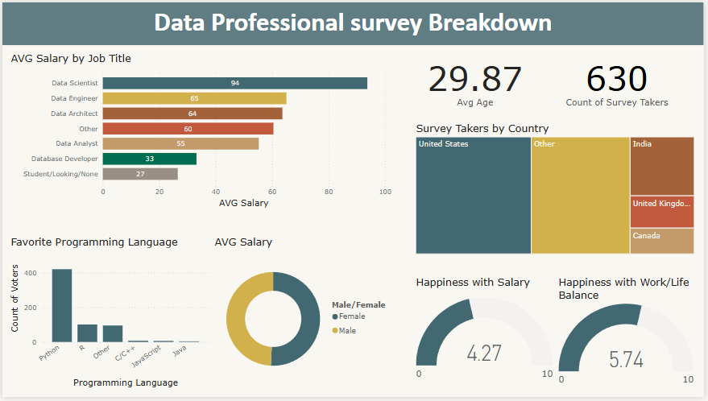

# Data Professional Survey Dashboard

This project contains a Power BI dashboard built to analyze survey results from data professionals around the world.

## Overview

The dashboard provides insights into:

- **Average Salary** by Job Title (e.g., Data Scientist, Data Engineer, etc.)
- **Average Age** and total **Survey Takers Count**
- **Survey Participants by Country**
- **Favorite Programming Languages**
- **Average Salary by Gender**
- **Happiness with Salary** and **Happiness with Work/Life Balance**

## Dashboard Preview

## Files

- `DataProfessionalSurvey.pbix` — The Power BI dashboard file.

---
